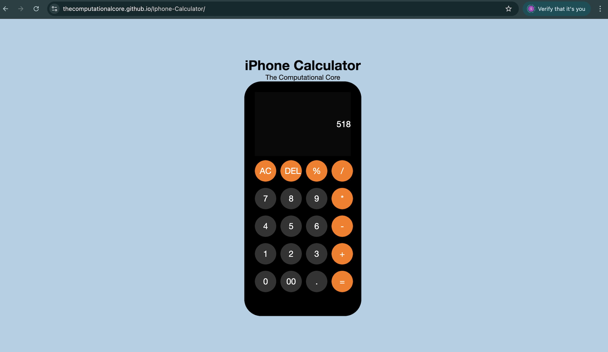

# 📱 iPhone Calculator — DOM-Based Mini Project

[](https://github.com/TheComputationalCore/Iphone-Calculator/actions/workflows/deploy.yml)
[](https://github.com/TheComputationalCore/Iphone-Calculator/actions/workflows/html-lint.yml)
[](https://github.com/TheComputationalCore/Iphone-Calculator/actions/workflows/css-lint.yml)
[](https://github.com/TheComputationalCore/Iphone-Calculator/actions/workflows/prettier.yml)
[](LICENSE)

A modern, responsive **iPhone-style Calculator** built entirely using **DOM Manipulation**, **HTML5**, **CSS3**, and **Vanilla JavaScript**.  
This project also includes professional CI/CD workflows, code linting, auto-formatting, and GitHub Pages deployment.

---

## 🚀 Live Demo  
👉 **https://thecomputationalcore.github.io/Iphone-Calculator/**

---

## 📂 Project Structure  
```
Iphone-Calculator/
├── index.html
├── style.css
├── script.js
├── screenshots/   (optional if added)
├── .github/workflows/
│   ├── deploy.yml
│   ├── html-lint.yml
│   ├── css-lint.yml
│   ├── prettier.yml
└── README.md
```

---

## ✨ Features

### 🧩 Core Functionality  
- Fully functional calculator  
- Supports AC, DEL, %, +, -, *, /  
- Decimal input  
- Double-zero (00) support  
- Live result updates  
- Error handling for invalid expressions  

### ⌨ Keyboard Support  
- Numbers (0–9)  
- Operators (+ - * / %)  
- **Enter → equals**  
- **Backspace → DEL**  
- **Delete → AC**  

### 🎨 UI & Styling  
- iPhone-inspired UI  
- Rounded buttons  
- Dark display panel  
- Responsive layout  
- Smooth spacing & grid button layout  

### 🧠 JavaScript (DOM Manipulation)  
- Entire UI dynamically created  
- Clean button mapping array  
- Safe evaluation using `try/catch`  
- Prevents invalid operator sequences  

---

## 🛠 Tech Stack


---

## 📸 Screenshots  


```

```

---

## ▶️ Running Locally

1. Clone the repository:
   ```bash
   git clone https://github.com/TheComputationalCore/Iphone-Calculator.git
   ```

2. Open the project folder:
   ```bash
   cd Iphone-Calculator
   ```

3. Open in browser:
   ```
   index.html
   ```

---

## 🚀 Deployment  
This project deploys automatically using **GitHub Pages**.  
Workflow: `.github/workflows/deploy.yml`

Live URL updates automatically on every push to `main`.

---

## 📝 License  
This project is licensed under the **MIT License**.

---

## 🌟 Author  
**TheComputationalCore**  
Building elegant & professional frontend mini‑projects.
